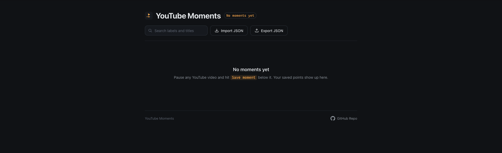
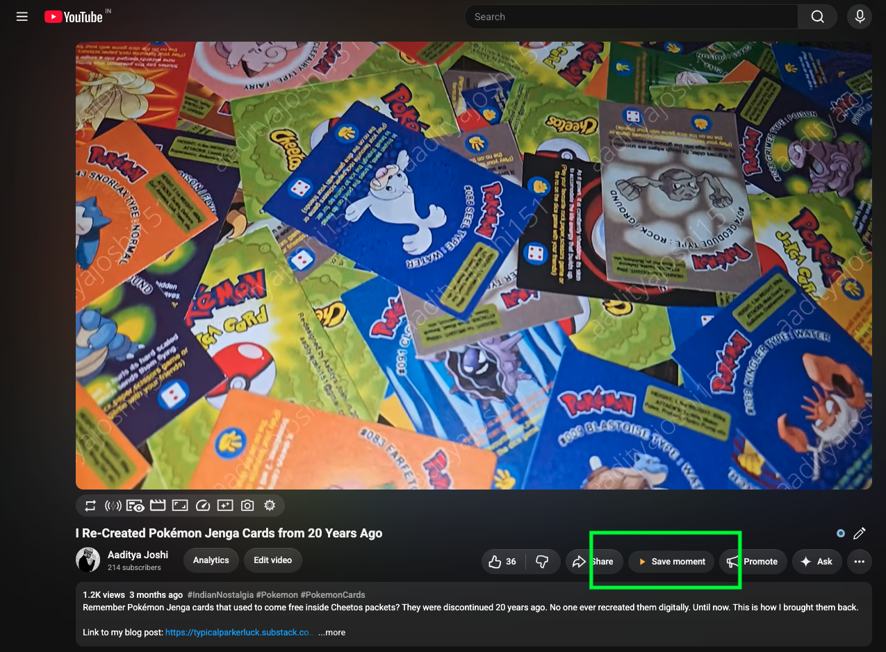

<div align="center">
  

# YouTube Moments

</div>

A lightweight browser extension for saving exact timestamps ("moments") from YouTube videos and revisiting them later.

> [!IMPORTANT]
>
> This is a personal project and was built with the assistance of AI (Claude).

## Features

- **Save moment** - adds a button to the action row under any YouTube video. Clicking it captures the current playback timestamp and lets you attach an optional note.
- **Moments page** - click the toolbar icon to open a dedicated full-page view of everything you've saved, with:
  - Search across titles and notes
  - Pagination for large collections
  - Inline editing and deletion of saved moments
  - Share a moment as a ready-made message (for WhatsApp, Slack, etc.), or just copy the link
  - Export to a JSON file and import from a previously exported file
- **Local-only storage** — moments are stored using the browser's local extension storage

## Screenshots


_Moments screen (empty)_


_Save moments button_


_Moments screen (with moment)_

## Installation

Requires Firefox 140 or later.

1. Clone this repository.
2. Open `about:debugging#/runtime/this-firefox` in Firefox.
3. Click **Load Temporary Add-on…**.
4. Select the `manifest.json` file from this repository.

The extension icon will appear in the toolbar. Click it at any time to open the Moments page. Pin the icon on the toolbar for easier access.

## Usage

1. Go to any YouTube video (`youtube.com/watch?v=...`).
2. Click **Save moment** below the video at the point you want to remember.
3. Optionally add a note, then confirm.
4. Click the extension's toolbar icon to view, search, edit, export, or delete your saved moments.

## Permissions

- `storage` — used to persist saved moments locally in the browser.

## Building a release

```
npm run lint   # validates manifest.json and source with web-ext
npm run build  # packages the extension into web-ext-artifacts/*.zip
```
